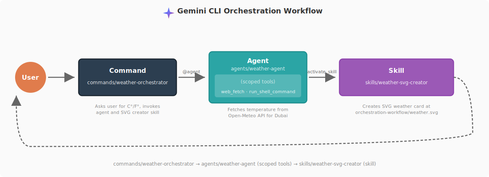

# gemini-cli-best-practice
from vibe coding to agentic engineering — practice makes gemini perfect

-white?style=flat&labelColor=555) <a href="https://github.com/shanraisshan/gemini-cli-best-practice/stargazers"></a><br>

[](best-practice/) [](implementation/) [](orchestration-workflow/orchestration-workflow.md) [](https://github.com/google-gemini/gemini-cli) [](https://x.com/ntaylormullen) [](#-tips-and-tricks-29) <br>
 = Agents ·  = Skills ·  = Commands

<p align="center">
  
</p>

## 🧠 CONCEPTS

| Feature | Location | Description |
|---------|----------|-------------|
|  [**Subagents**](https://geminicli.com/docs/core/subagents/) | `.gemini/agents/<name>.md` | [](best-practice/gemini-agents.md) [](implementation/gemini-agents-implementation.md) Specialized actors with isolated context, scoped tools, and custom system prompts · auto-delegate or explicit `@agent` invocation · built-ins: `codebase_investigator`, `cli_help`, `generalist`, `browser_agent` (v0.38.1+) |
|  [**Agent Skills**](https://geminicli.com/docs/cli/skills/) | `.gemini/skills/<name>/SKILL.md` | [](best-practice/gemini-skills.md) [](implementation/gemini-skills-implementation.md) First-class primitive (v0.23.0+) — `name` + `description` only frontmatter, optional `scripts/` / `references/` / `assets/` subfolders · progressive disclosure via `activate_skill` tool with user consent · Workspace > User > Extension precedence |
|  [**Commands**](https://geminicli.com/docs/reference/commands/) | `.gemini/commands/<name>.toml` | [](best-practice/gemini-commands.md) [](implementation/gemini-commands-implementation.md) TOML prompt templates with `{{args}}`, `!{shell}`, and `@path` injection. Sub-folders create namespaces (`git/commit.toml` → `/git:commit`). |
| [**Workflow**](orchestration-workflow/orchestration-workflow.md) | `.gemini/commands/weather-orchestrator.toml` | [](orchestration-workflow/orchestration-workflow.md)  **Command** →  **Agent** →  **Skill** |
| [**MCP Servers**](https://modelcontextprotocol.io/) | `.gemini/settings.json` → `mcpServers` | Model Context Protocol integrations (Playwright, Context7, Google Workspace, Figma, GitHub, custom). |
| [**Extensions**](https://github.com/google-gemini/gemini-cli/blob/main/docs/extensions/index.md) | `gemini extensions install <name>` | Distributable bundles of commands + MCP servers + scoped `GEMINI.md`. |
| [**Memory**](https://github.com/google-gemini/gemini-cli/blob/main/docs/cli/configuration.md) | `GEMINI.md`, `.gemini/GEMINI.md`, `~/.gemini/GEMINI.md` | [](best-practice/gemini-memory.md) [](implementation/gemini-memory-implementation.md) Tree-merged memory with `@path` imports and `/memory` runtime commands. |
| [**Settings**](https://github.com/google-gemini/gemini-cli/blob/main/docs/cli/configuration.md) | `.gemini/settings.json` | [](best-practice/gemini-settings.md) [](.gemini/settings.json) Hierarchical config: flags > env vars > local > project > user > defaults. |
| [**Checkpointing**](https://github.com/google-gemini/gemini-cli/blob/main/docs/checkpointing.md) | `--checkpointing`, `/restore` | Pre-edit file snapshots with session-local rollback. |
| [**CLI Startup Flags**](https://github.com/google-gemini/gemini-cli/blob/main/docs/cli/index.md) | `gemini [flags]` | [](best-practice/gemini-cli-startup-flags.md) Flags, subcommands (`gemini mcp add`, `gemini extensions install`), and environment variables. |
| **AI Terms** | | Agentic Engineering · Context Engineering · Vibe Coding |
| **Official Docs** | | [](https://github.com/google-gemini/gemini-cli) [Gemini CLI](https://github.com/google-gemini/gemini-cli) · [Gemini API](https://ai.google.dev/gemini-api/docs) · [MCP](https://modelcontextprotocol.io/) |

### 🔥 Hot

| Feature | Where | Description |
|---------|-------|-------------|
| **YOLO Mode**  | `--yolo` / `-y` | Auto-approves every tool call — sandbox/CI only, never on your workstation |
| **Headless Mode** | `gemini -p "<prompt>"` | One-shot invocation; pipes through stdin/stdout for CI/cron |
| **Checkpointing** | `--checkpointing` + `/restore` | File-level undo for exploratory refactors |
| **Multi-directory** | `--include-directories ../other` | Reason across multiple repos in one session |
| **`@path` injection** | inside prompts & commands | Multimodal — `@file.png`, `@file.pdf`, `@file.mp3` all work |
| **Shell passthrough** | `!cmd` (single) or `!` (persistent) | Run shell without leaving Gemini |
| **`/compress`** | built-in | Summarizes the chat to free context window |
| **`/chat save` / `/chat resume`** | built-in | Multi-session conversation persistence |
| **IDE integration** | VS Code / JetBrains plugins | Diffs and code context pipe into the CLI |
| **GitHub Actions** | [`google-gemini/gemini-cli-action`](https://github.com/google-gemini/gemini-cli-action) | Gemini-driven PR review and triage in CI |
| **Extensions** | `gemini extensions install` | Community packs with commands + MCP servers bundled |
| **Google Workspace MCP** | `google-workspace` MCP server | Paste a Docs/Sheets link, get a summary |
| **Sandbox**  | `GEMINI_SANDBOX=1` | Container / macOS Seatbelt isolation for file/shell tools |
| **Telemetry (local)** | `telemetry.target: "local"` | Offline observability for tool calls and tokens |
| **Vertex AI auth** | `selectedAuthType: "vertex-ai"` | Enterprise-grade auth with GCP IAM |

<p align="center">
  
</p>

<a id="orchestration-workflow"></a>

## <a href="orchestration-workflow/orchestration-workflow.md"></a>

See [orchestration-workflow](orchestration-workflow/orchestration-workflow.md) for implementation details of the  **Command** →  **Agent** →  **Skill** pattern — built on Gemini CLI's TOML commands, native subagents (v0.38.1+), and first-class Agent Skills (v0.23.0+).

<p align="center">
  
</p>


```bash
gemini
/weather-orchestrator
```

Gemini asks for your unit, fetches the temperature from Open-Meteo, writes an SVG card, and prints the paths. The full command prompt: [`.gemini/commands/weather-orchestrator.toml`](.gemini/commands/weather-orchestrator.toml).

<p align="center">
  
</p>

## ⚙️ DEVELOPMENT WORKFLOWS

All major workflows converge on the same architectural pattern: **Research → Plan → Execute → Review → Ship**.

| Name | ★ | Workflow |  |  |  |
|------|---|----------|---|---|---|
| [Superpowers](https://github.com/obra/superpowers) | 171k |  →  →  →  →  →  | 5 | 3 | 14 |
| [Everything Claude Code](https://github.com/affaan-m/everything-claude-code) | 167k |  →  →  →  →  →  | 48 | 143 | 230 |
| [Spec Kit](https://github.com/github/spec-kit) | 92k |  →  →  →  →  | 0 | 9+ | 0 |
| [gstack](https://github.com/garrytan/gstack) | 86k |  →  →  →  →  →  →  →  →  | 0 | 0 | 37 |
| [Get Shit Done](https://github.com/gsd-build/get-shit-done) | 58k |  →  →  →  →  →  →  | 33 | 122 | 0 |
| [BMAD-METHOD](https://github.com/bmad-code-org/BMAD-METHOD) | 46k |  →  →  →  →  →  →  →  →  | 0 | 0 | 39 |
| [OpenSpec](https://github.com/Fission-AI/OpenSpec) | 44k |  →  →  | 0 | 11 | 0 |
| [oh-my-claudecode](https://github.com/Yeachan-Heo/oh-my-claudecode) | 31k |  →  →  →  →  →  →  →  →  | 19 | 0 | 37 |
| [Compound Engineering](https://github.com/EveryInc/compound-engineering-plugin) | 16k |  →  →  →  →  →  →  | 50 | 4 | 44 |

> *Note: yellow tags are sub-loops — steps that repeat inside a parent step (e.g. per task, per story, or until a verify condition passes).*

### Others

- **Taylor Mullen** (Creator of Gemini CLI) Workflow — [](https://x.com/ntaylormullen) · [GitHub](https://github.com/NTaylorMullen) · [X](https://x.com/ntaylormullen) · [Gemini CLI repo](https://github.com/google-gemini/gemini-cli)
- **Addy Osmani** (Google DevRel) Workflow — 29 Tips [](tips/gemini-addyosmani-29-tips.md) · [source](https://github.com/addyosmani/gemini-cli-tips) · [X](https://x.com/addyosmani)

<p align="center">
  
</p>

## 💡 TIPS AND TRICKS (29+)

🚫👶 = do not babysit

[Memory](#tips-memory) · [GEMINI.md](#tips-geminimd) · [Agents](#tips-agents) · [Skills](#tips-skills) · [Commands](#tips-commands) · [MCP](#tips-mcp) · [Context](#tips-context) · [Safety](#tips-safety) · [Automation](#tips-automation) · [Cost & Observability](#tips-cost)


<a id="tips-memory"></a>■ **Memory & Persistence (4)**

| Tip | Source |
|-----|--------|
| store project-specific instructions in [GEMINI.md](best-practice/gemini-memory.md) for zero-prompt context — auto-loaded every session | [](tips/gemini-addyosmani-29-tips.md) |
| `/memory add <fact>` · `/memory show` · `/memory refresh` for runtime facts — volatile but beats retyping | [](tips/gemini-addyosmani-29-tips.md) |
| `/chat save <tag>` + `/chat resume <tag>` for parallel multi-day threads — context survives across days 🚫👶 | [](tips/gemini-addyosmani-29-tips.md) |
| `/compress` at ~50% context before auto-compact fires at the model's least intelligent point | [](tips/gemini-addyosmani-29-tips.md) |

<a id="tips-geminimd"></a> **GEMINI.md (3)**

> GEMINI.md and its nested variants hold persistent context. Keep them focused — the same lazy-loading pattern Claude Code uses applies here.

| Tip | Source |
|-----|--------|
| keep each [GEMINI.md](best-practice/gemini-memory.md) under ~200 lines — longer files dilute attention and the model starts ignoring rules | [](best-practice/gemini-memory.md) |
| for monorepos, push scoped instructions into per-package `GEMINI.md` files rather than one mega root file — ancestor + descendant loading covers the tree | [](best-practice/gemini-memory.md) |
| use `@path` imports inside `GEMINI.md` to pull in style guides or build docs — cheaper and more reliable than pasting content inline | [](best-practice/gemini-memory.md) |

<a id="tips-agents"></a> **Agents (5)**

| Tip | Source |
|-----|--------|
| delegate long, tool-heavy work to the built-in [`codebase_investigator`](https://geminicli.com/docs/core/subagents/) — 20 file reads + 12 greps stay in the child's context, only the final report returns 🚫👶 | [](https://geminicli.com/docs/core/subagents/) |
| use `@agent_name` in the prompt to force a specific subagent — auto-delegation via `description:` matching works, but explicit is more reliable for orchestrated flows | [](https://github.com/google-gemini/gemini-cli/discussions/25562) |
| scope `tools:` tightly — read-only allowlist for audit agents, no MCP for offline agents · `tools: ["*"]` means the agent can do anything, scope explicitly | [](best-practice/gemini-agents.md) |
| write a specific `description:` — it's what the main agent reads to decide when to delegate · "helpful assistant" gets ignored, "Reviews diffs for SQLi/XSS/SSRF before merging auth PRs" gets routed | [](best-practice/gemini-agents.md) |
| drop `temperature: 0.2` for review / audit agents; let generators run at `1.0` — deterministic reviewers, creative generators | [](best-practice/gemini-agents.md) |

<a id="tips-skills"></a> **Skills (5)**

| Tip | Source |
|-----|--------|
| treat the skill `description:` as a trigger, not a summary — "Use this skill to X. It handles Y. Activate when Z." routes reliably | [](https://geminicli.com/docs/cli/skills/) |
| skills are folders, not files — use `scripts/`, `references/`, `assets/` subdirectories for [progressive disclosure](https://geminicli.com/docs/cli/skills/) so activation is cheap | [](best-practice/gemini-skills.md) |
| include scripts and asset templates in skills so the model **composes** rather than reconstructs boilerplate each time | [](best-practice/gemini-skills.md) |
| don't put skills that fetch data — use subagents for fetching · skills are procedural (render, review, migrate) | [](best-practice/gemini-skills.md) |
| precedence is Workspace > User > Extension — rename on name collisions instead of relying on shadowing | [](https://geminicli.com/docs/cli/skills/) |

<a id="tips-commands"></a> **Commands (4)**

| Tip | Source |
|-----|--------|
| TOML slash commands in `.gemini/commands/` — namespace with sub-folders · `git/commit.toml` → `/git:commit` | [](tips/gemini-addyosmani-29-tips.md) |
| inject shell output at load time with `!{cmd}` instead of asking the model to run it — deterministic and the prompt reads the result directly | [](best-practice/gemini-commands.md) |
| `~/.gemini/settings.json` for cross-project personal defaults; project-level `.gemini/settings.json` for team-shared | [](tips/gemini-addyosmani-29-tips.md) |
| if you do something more than once a day, turn it into a skill or command — build `/status`, `/techdebt`, `/review:security` | [](tips/gemini-addyosmani-29-tips.md) |

<a id="tips-mcp"></a>■ **MCP & Integrations (4)**

| Tip | Source |
|-----|--------|
| MCP servers are first-class — Figma, Google Workspace, GitHub, Playwright, proprietary DBs all plug in via `.gemini/settings.json → mcpServers` | [](tips/gemini-addyosmani-29-tips.md) |
| paste Google Docs / Sheets links directly into prompts once the Workspace MCP is configured — Gemini fetches and summarizes on the spot | [](tips/gemini-addyosmani-29-tips.md) |
| ask Gemini to write and spin up a temporary MCP server mid-session when you hit a gap — it generates the server, you register it, and the tool is live for the rest of the session | [](tips/gemini-addyosmani-29-tips.md) |
| IDE plugins (VS Code / JetBrains) pipe diffs and code context straight into the CLI — skip the copy/paste dance | [](tips/gemini-addyosmani-29-tips.md) |

<a id="tips-context"></a>■ **Context & Input (5)**

| Tip | Source |
|-----|--------|
| `@./path` injects files, directories, images, PDFs, and audio into the prompt — multimodal works out of the box | [](tips/gemini-addyosmani-29-tips.md) |
| `--include-directories ../sibling,../shared` works across multiple repos in one session — cross-repo reasoning without leaving Gemini | [](tips/gemini-addyosmani-29-tips.md) |
| AI-assisted file organization — point Gemini at a messy directory and ask it to classify, rename (using vision), dedupe | [](tips/gemini-addyosmani-29-tips.md) |
| multimodal OCR — invoice parsing, UI mockup analysis, audio transcription, chart reading all via `@file.png` / `@file.pdf` / `@file.mp3` | [](tips/gemini-addyosmani-29-tips.md) |
| `/stats` shows token usage — structure long prompts so the stable prefix comes first to benefit from cache hits | [](tips/gemini-addyosmani-29-tips.md) |

<a id="tips-safety"></a>■ **Safety & Modes (4)**

| Tip | Source |
|-----|--------|
| `--checkpointing` snapshots files before every edit · `/restore` rolls back · safety net for exploratory refactors | [](tips/gemini-addyosmani-29-tips.md) |
| prefer scoped allowlists (`Shell(npm test)`, `WebFetch(domain:*.google.com)`) over global `--yolo` — scoped auto-approval doesn't unlock `rm -rf /` | [](https://github.com/google-gemini/gemini-cli) |
| `GEMINI_SANDBOX=1` for container / macOS Seatbelt isolation when the session touches untrusted code or data | [](tips/gemini-addyosmani-29-tips.md) |
| restrict `$PATH` for Gemini CLI so it can't reach unwanted tools — improves safety in CI and shared envs 🚫👶 | [](tips/gemini-addyosmani-29-tips.md) |

<a id="tips-automation"></a>■ **Automation & Scripting (4)**

| Tip | Source |
|-----|--------|
| `gemini -p "<prompt>"` for headless / CI / scheduled runs · pipes through stdin/stdout, no chat UI | [](tips/gemini-addyosmani-29-tips.md) |
| `GEMINI_SYSTEM_MD=./ci-prompt.md` replaces the baked-in system prompt — perfect for scoping CI personas per job | [](tips/gemini-addyosmani-29-tips.md) |
| `!cmd` shell passthrough for one-shot commands; `!` alone enters persistent shell mode — terminal without leaving the session | [](tips/gemini-addyosmani-29-tips.md) |
| your entire `$PATH` (Docker, ffmpeg, ImageMagick, gcloud, kubectl) is Gemini's toolkit — CLI tools beat asking the model to re-implement them | [](tips/gemini-addyosmani-29-tips.md) |

<a id="tips-cost"></a>■ **Cost & Observability (3)**

| Tip | Source |
|-----|--------|
| `/stats` for token usage and cache-hit insight — catch context bloat before it hits your wallet | [](tips/gemini-addyosmani-29-tips.md) |
| local telemetry on (`telemetry.target: "local"`) for session-level observability — tool calls, tokens, durations without data leaving the machine | [](tips/gemini-addyosmani-29-tips.md) |
| `summarizeToolOutput` in settings caps tool-call context bloat — long `ReadFile` / `Shell` outputs get summarized before being appended | [](best-practice/gemini-settings.md) |

<p align="center">
  
</p>


```
1. Read the repo like a course — learn what commands, agents, and skills are before trying to use them.
2. Clone this repo and play with the examples. Try /weather-orchestrator, watch @weather-agent run in isolated context, and consent to the weather-svg-creator skill activation so you can see how the pieces connect.
3. Go to your own project and ask Gemini to suggest what best practices from this repo you should add — give it this repo as a reference so it knows what's possible.
```

<p align="center">
  
</p>

## 🔔 SUBSCRIBE

| Source | Name | Badge |
|--------|------|-------|
|  | [r/GoogleGeminiAI](https://www.reddit.com/r/GoogleGeminiAI/), [r/GeminiAI](https://www.reddit.com/r/GeminiAI/), [r/Bard](https://www.reddit.com/r/Bard/), [r/google](https://www.reddit.com/r/google/), [r/googlecloud](https://www.reddit.com/r/googlecloud/) |  |
|  | [Google AI](https://x.com/GoogleAI), [Google DeepMind](https://x.com/GoogleDeepMind), [Gemini App](https://x.com/GeminiApp), [Taylor Mullen](https://x.com/ntaylormullen) (Creator of Gemini CLI), [Allen Hutchison](https://x.com/allen_hutchison) (Gemini CLI Lead), [Jack Wotherspoon](https://x.com/JackWoth98) (Gemini CLI DevRel), [Addy Osmani](https://x.com/addyosmani) (Google DevRel), [Paige Bailey](https://x.com/DynamicWebPaige) (AI DevX Lead), [Logan Kilpatrick](https://x.com/OfficialLoganK) (AI Studio Lead), [Sundar Pichai](https://x.com/sundarpichai), [Demis Hassabis](https://x.com/demishassabis), [Jeff Dean](https://x.com/JeffDean), [Oriol Vinyals](https://x.com/OriolVinyalsML), [Koray Kavukcuoglu](https://x.com/koraykv), [Noam Shazeer](https://x.com/NoamShazeer), [Quoc Le](https://x.com/quocleix), [Jack Rae](https://x.com/jack_w_rae), [Denny Zhou](https://x.com/denny_zhou), [Ankur Bapna](https://x.com/ankurbpn), [Josh Woodward](https://x.com/joshwoodward), [Tulsee Doshi](https://x.com/tulseedoshi) |  |
|  | [Google DeepMind](https://www.youtube.com/@GoogleDeepMind), [Google for Developers](https://www.youtube.com/@GoogleDevelopers), [Google AI Developers](https://www.youtube.com/@googleaidevs), [Google Cloud Tech](https://www.youtube.com/@GoogleCloudTech) |  |

<p align="center">
  
</p>

## Other Repos

<table>
<tr>
<td align="center" width="140">
  <a href="https://github.com/shanraisshan/gemini-cli-hooks"></a><br>
  <a href="https://github.com/shanraisshan/gemini-cli-hooks"><strong>Gemini CLI<br>Hooks</strong></a>
</td>
<td align="center" width="140">
  <a href="https://github.com/shanraisshan/claude-code-best-practice"></a><br>
  <a href="https://github.com/shanraisshan/claude-code-best-practice"><strong>Claude Code<br>Best Practice</strong></a>
</td>
<td align="center" width="140">
  <a href="https://github.com/shanraisshan/claude-code-hooks"></a><br>
  <a href="https://github.com/shanraisshan/claude-code-hooks"><strong>Claude Code<br>Hooks</strong></a>
</td>
<td align="center" width="140">
  <a href="https://github.com/shanraisshan/codex-cli-best-practice"></a><br>
  <a href="https://github.com/shanraisshan/codex-cli-best-practice"><strong>Codex CLI<br>Best Practice</strong></a>
</td>
<td align="center" width="140">
  <a href="https://github.com/shanraisshan/codex-cli-hooks"></a><br>
  <a href="https://github.com/shanraisshan/codex-cli-hooks"><strong>Codex CLI<br>Hooks</strong></a>
</td>
</tr>
</table>

##  Sponsor My Work

If you like my work, buy me a doodh patti 🍵 on

<a href="https://buy.polar.sh/polar_cl_X7sdBf79tkHyDXmbaGG6DET8IFzYD4JMSD1Q81DL0IV"></a> <a href="https://buy.polar.sh/polar_cl_X7sdBf79tkHyDXmbaGG6DET8IFzYD4JMSD1Q81DL0IV"><strong>Polar</strong></a>


